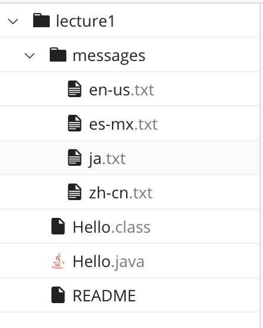

# Lab Report 1 "Remote Access and FileSystem"

**For each of the commands cd, ls, and cat, I will share an example of the command being used with...**
1. no arguments
2. a path to a directory as an argument
3. a path to a file as an argument

---

**Here is what my file structure looks like at the start of the lab**



---

## Command: "cd"
1. **Usage w/ no args**
   ```
   [user@sahara ~]$ pwd
   /home
   [user@sahara ~]$ cd
   [user@sahara ~]$
   ```
   It seems that I did not receive any significant output since I did not provide any directory to change to from my current working directory. Despite not receiving any explicit output, this is not an error. My current working directory remained the same because I did not instruct the terminal to change to another directory.
   
2. **Usage w/ a path to a directory as an arg**
   ```
   [user@sahara ~]$ pwd
   /home
   [user@sahara ~]$ cd lecture1
   [user@sahara ~/lecture1]$
   ```
   In this example, my directory changed from the home folder into the lecture1 folder since the argument lecture1 was found in the current working directory. The last prompt shows that I am now in the lecture1 directory. No error was received.
   
3. **Usage w/ a path to a file as an arg**
   ```
   [user@sahara ~/lecture1]$ pwd
   /home/lecture1
   [user@sahara ~/lecture1]$ cd Hello.java
   bash: cd: Hello.java: Not a directory
   ```
   I received an error in this example because I instructed the terminal to change its current working directory into a file. A directory and a file are not the same. A directory can hold either other directories and files while a file only contains content relevant to that file and marks the end of its path.
   
## Command: "ls"
1. **Usage w/ no args**
   ```
   [user@sahara ~]$ pwd
   /home
   [user@sahara ~]$ ls
   lecture1
   ```
   ls is a command that "lists" out the folders and files in the specified path. In this case, however, I did not specify any path for ls to list out for me. When no argument is passed to an ls command, ls lists the contents of the current working directory. This was not an error.
   
3. **Usage w/ a path to a directory as an arg**
   ```
   [user@sahara ~]$ pwd
   /home
   [user@sahara ~]$ ls lecture1
   Hello.class  Hello.java  messages  README
   ```
   In contrast to the previous example, a path to a directory was provided to the ls command. In my current working directory (/home) is a folder that is named lecture1. Since this is a valid directory within my working directory ls succesfully returned ouput listing the contents in the lecture1 directory.
   
5. **Usage w/ a path to a file as an arg**
   ```
   [user@sahara ~]$ pwd
   /home
   [user@sahara ~]$ ls lecture1/Hello.java
   lecture1/Hello.java
   ```
   In this case I gave the path to the Hello.java file in the lecture directory. Hello.java is a file so it cannot contain any other files for ls to output. Since I was not in the directory that Hello.java is store in, ls returned its relative path.
   
## Command: "cat"
1. **Usage w/ no args**
   ```
   [user@sahara ~]$ pwd
   /home
   [user@sahara ~]$ cat
   test
   test
   test1
   test1
   ^C
   [user@sahara ~]$
   ```
   This case resulted in interestig behavior. cat is a command that outputs the complete contents of specified files. In this example I did not provide any file for cat to print out. After calling this command no new prompt was available for me but instead, I was able to continue typing in the terminal. In the line after where I call cat, I typed "test" and hit enter. Afterwards, the terminal responded back with an identical string. I was able to continue this behavior until I terminated the command with hitting ctrl+c. Despite the interesting behavior I do not believe this is an error.
   
3. **Usage w/ a path to a directory as an arg**
   ```
   [user@sahara ~]$ pwd
   /home
   [user@sahara ~]$ cat lecture1
   cat: lecture1: Is a directory
   ```
   Since cat is meant to output the contents of a file or more than one file, this example caused the terminal to return an error. I provided the directory lecture1 which exists within my current working directory but since it is not a file the command was unable to print out any text within a file.
   
5. **Usage w/ a path to a file as an arg**
   ```
   [user@sahara ~]$ pwd
   /home
   [user@sahara ~]$ cat lecture1/messages/en-us.txt
   Hello World!
   ```
