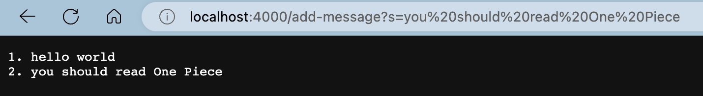
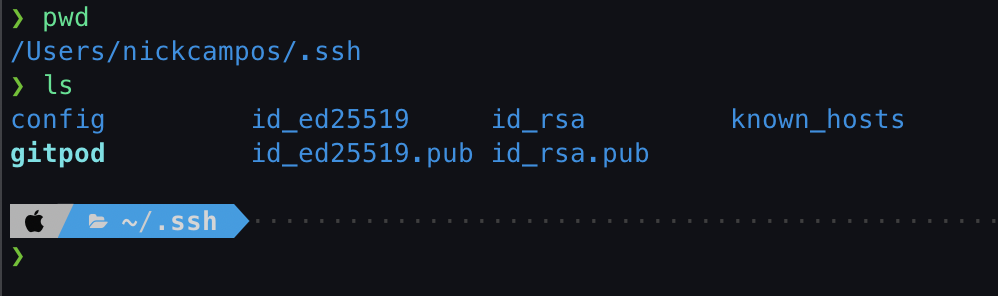
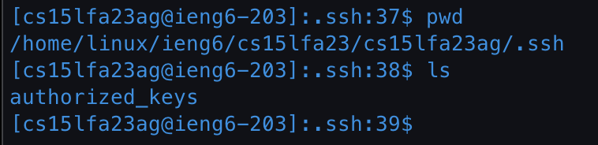
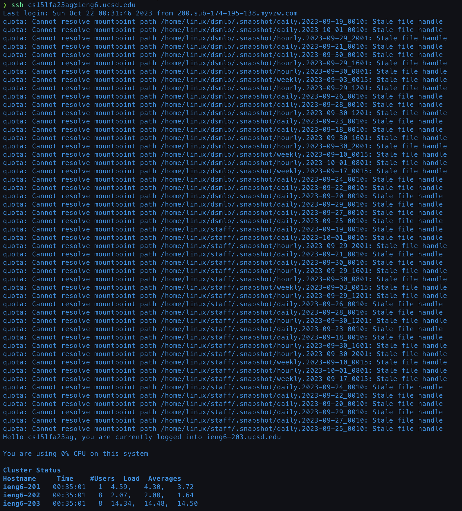

# Lab Report 2 "Servers and SSH Keys"

## Part 1

### StringServer.java

```java
import java.io.IOException;
import java.net.URI;
import java.util.ArrayList;

class Handler implements URLHandler {
  ArrayList<String> messages = new ArrayList<String>();

  public String handleRequest(URI url) {
    if (url.getPath().equals("/add-message")) {
      String[] params = url.getQuery().split("=");
      if (params[0].equals("s")) {
        messages.add(params[1]);
        return constructString();
      }
    }
    return "404 Not Found!";
  }

  public String constructString() {
    String result = "";
    String template = "%d. %s \n";
    for (int i = 0; i < messages.size(); i++) {
      result += String.format(template, i + 1, messages.get(i));
    }
    return result;
  }
}

class StringServer {
  public static void main(String[] args) throws IOException {
    if (args.length == 0) {
      System.out.println("Missing port number! Try any number between 1024 to 49151");
      return;
    }

    int port = Integer.parseInt(args[0]);

    Server.start(port, new Handler());
  }
}
```

---

### Query 1: hello world


#### Methods Called

When I entered this url, my code called the `handleRequest` method. Another function,
`constructString`, is also called when returning the final ouput within `handleRequest`.

#### Method Arguments + Relevant Field Values

`handleRequest(URI url)` takes in a URI parameter that is labeled as `url`. `url` is the value of the url that is entered in the search bar. The url I entered into the search bar was `http://localhost:4000/add-message?s=hello world` but after entering it, the url changed to `http://localhost:4000/add-message?s=hello%20world`. The value of the argument passed to `handleRequest` is the former.

`constructString()` takes in no arguments. It is a helper function that constructs the final output to be stored in the  `result` variable that is returned by `handleRequest`. `result` is constructed by iterating through the `messages` ArrayList and adding each String in the ArrayList by utilizing the format method and a String template called `template`.

At the start, before any invocation of `handleRequest`, the server's `Handler` object has an empty ArrayList of Strings called `messages`.

#### Changed Values

After the first call to `handleRequest` with the passed argument discussed above, the value of "hello world" was added to `messages`.

---

### Query 2: you should read One Piece



#### Methods Called

Like in the first example, `handleRequest` and `constructString` were both called in this instance.

#### Method Arguments + Relevant Field Values

In this instance, `http://localhost:4000/add-message?s=you should read One Piece` was passed to `handleRequest`.

Again, `constructString` was given no arguments.

Before the second call to `handleRequest`, `messages` in the server's `Handler` object contained a single String value which was "hello world".

#### Changed Values

After calling `handleRequest` for the second time, the String value of "you should watch One Piece" was added to `messages`. Because `messages` is an ArrayList of Strings the current size is now 2 where the first String is "hello world" and the second value is "you should read One Piece".

## Part 2

### Path to the Private Key (From my personal machine)



The private key's file is `id_rsa`. Its path is `~/Users/nickcampos/.ssh/id_rsa`

### Path to the Public Key (From my account on ieng6)



The public key's file is `authourized_keys`. Its path is `~/home/linux/ieng6/cs15lfa23/cs15lfa23ag/.ssh/authorized_keys`

### No Password ieng6



## Part 3

In week 2, I learned that you can connect to remote servers using the `ssh` command. `ssh` stands for "Secure Socket Shell" and it gives users a secure way to access a computer over an unsecured network. With access to a remote server, users can execute commands remotely on the server while working on their personal or work machines.

I also learned how to copy files from local computers to remote computers using the `scp` command in week 3. `scp` stands for "Secure Copy" and it allows users to copy a file or a directory between local and remote servers. `scp` is also useful due to its file and password encryption.
