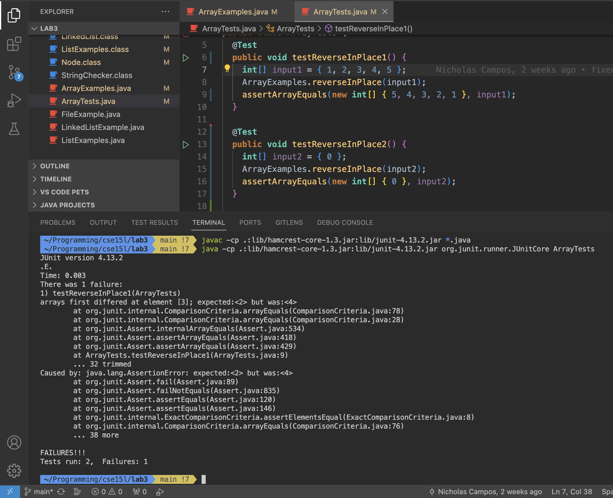

# Lab Report 3 "Bugs and Commands"

## Part 1 - Bugs

### Chosen Bug

I will be analyzing the bug observed in the `reverseInPlace` method from the `ArrayExamples` class.

A JUnit test with a **failure-inducing** input `[1, 2, 3, 4, 5]`

```java
	@Test
	public void testReverseInPlace1() {
    int[] input1 = { 1, 2, 3, 4, 5 };
    ArrayExamples.reverseInPlace(input1);
    assertArrayEquals(new int[] { 5, 4, 3, 2, 1}, input1);
	}
```

A JUnit test with input that **does not induce a failure** `[0]`

```java
	@Test
	public void testReverseInPlace2() {
    int[] input2 = { 0 };
    ArrayExamples.reverseInPlace(input2);
    assertArrayEquals(new int[] { 0 }, input2);
	}
```

Symptom Output



In the above image, I ran two tests `testReverseInPlace1` and `testReverseInPlace2`. The first test tests the `reverseInPlace` method on the input { 1, 2, 3, 4, 5} and the second tests tests the same method on the input { 0 }. The symptom In the first test was `arrays first differed at element [3]; expected:<2> but was:<4>`. After running the first input in the first test, `reverseInPlace` returned the list { 5, 4, 3, 4, 5} which is not what is expected - I expected the method to return {5, 4, 3, 2, 1}. The second test passed since the input it was given is a case where the bug in `reverseInPlace` does not effect its output.

The bug **BEFORE** implementing its fix

```java
  static void reverseInPlace(int[] arr) {
    for(int i = 0; i < arr.length; i += 1) {
      arr[i] = arr[arr.length - i - 1];
    }
  }
```

The bug **AFTER** implementing its fix
```java
  static void reverseInPlace(int[] arr) {
    int [] arrCopy = new int[arr.length];
    for(int i = 0; i < arr.length; i++) {
      arrCopy[i] = arr[i];
    }
    for(int i = 0; i < arr.length; i += 1) {
      arr[i] = arrCopy[arr.length - i - 1];
    }
  }
```

In the 'before' implementation, the algorithm iterates through the input array from start to end. At each index, the index at the length of the array minus the current index minus another 1 is assigned to the current index. This reversal method works for the first half of the input but fails when the iteration reaches the second half. This is because the first half of the array is overwritten by the second half without saving the memory of the first half. This results in the first half of the array being a copy of the second half. The 'after' implementation is an appropriate fix because it creates a copy `arrCopy` of the input array. This resolves the issue of overwriting the first half of the input array in the before code.

## Part 2 - Researching Commands

### Chosen Command: `find` 

#### Option: `-newer`

```bash
find ./technical -newer ./technical/plos/pmed.0020039.txt
./technical
./technical/.DS_Store
./technical/plos
./technical/plos/pmed.0020273.txt
./technical/plos/pmed.0020065.txt
./technical/plos/pmed.0020071.txt
./technical/plos/pmed.0020059.txt
./technical/plos/pmed.0020104.txt
./technical/plos/pmed.0020272.txt
./technical/plos/pmed.0020258.txt
./technical/plos/pmed.0020099.txt
./technical/plos/pmed.0020113.txt
./technical/plos/pmed.0020098.txt
./technical/plos/pmed.0020067.txt
./technical/plos/pmed.0020073.txt
./technical/plos/pmed.0020249.txt
```

The `-newer` option used with find searches for files that were modified/created after the specified file or directory that follows the option. In this instance it looks for files or directories that were created after the `pmed.0020039.txt` file. The output seen in the code block above was only the first few lines. Its output was a long list of paths to files and other subdirectories.

```bash
find ./technical -newer ./technical/government/About_LSC
./technical
./technical/government
./technical/government/.DS_Store
./technical/government/About_LSC/reporting_system.txt
./technical/government/Env_Prot_Agen
./technical/government/Env_Prot_Agen/multi102902.txt
./technical/government/Env_Prot_Agen/section-by-section_summary.txt
./technical/government/Env_Prot_Agen/jeffordslieberm.txt
./technical/government/Env_Prot_Agen/final.txt
./technical/government/Env_Prot_Agen/ctf7-10.txt
./technical/government/Env_Prot_Agen/ctf1-6.txt
./technical/government/Env_Prot_Agen/ro_clear_skies_book.txt
./technical/government/Env_Prot_Agen/ctm4-10.txt
./technical/government/Env_Prot_Agen/1-3_meth_901.txt
./technical/government/Env_Prot_Agen/atx1-6.txt
./technical/government/Env_Prot_Agen/tech_sectiong.txt
./technical/government/Env_Prot_Agen/bill.txt
./technical/government/Env_Prot_Agen/nov1.txt
./technical/government/Env_Prot_Agen/tech_adden.txt
./technical/government/Alcohol_Problems
```

Similar to the above example, the output seen in the code block above was only the first few lines. Its output was a long list of paths to files and other subdirectories. In this case however, I passed a directory as an argument to the `-newer` option. 

source: https://www.geeksforgeeks.org/find-command-in-linux-with-examples/

#### Option: `-print`

```bash
find ./technical -print
./technical/plos/pmed.0010064.txt
./technical/plos/pmed.0020158.txt
./technical/plos/journal.pbio.0020042.txt
./technical/plos/journal.pbio.0020297.txt
./technical/plos/pmed.0020206.txt
./technical/plos/pmed.0020212.txt
./technical/plos/pmed.0020216.txt
./technical/plos/journal.pbio.0030094.txt
./technical/plos/journal.pbio.0020046.txt
./technical/plos/pmed.0020028.txt
./technical/plos/journal.pbio.0020052.txt
./technical/plos/pmed.0020148.txt
./technical/plos/pmed.0020160.txt
./technical/plos/pmed.0010048.txt
./technical/plos/pmed.0010060.txt
./technical/plos/journal.pbio.0030137.txt
./technical/plos/journal.pbio.0030136.txt
./technical/plos/pmed.0010061.txt
./technical/plos/pmed.0010049.txt
./technical/plos/pmed.0020161.txt
./technical/plos/journal.pbio.0020127.txt
./technical/plos/pmed.0020149.txt
./technical/plos/journal.pbio.0020133.txt
./technical/plos/pmed.0020015.txt
./technical/plos/journal.pbio.0020053.txt
```

In the above example, I printed all the files and directories in the ./technical directory.

```bash
find ./technical -name "journal*" -print
./technical/plos/journal.pbio.0030032.txt
./technical/plos/journal.pbio.0020354.txt
./technical/plos/journal.pbio.0020156.txt
./technical/plos/journal.pbio.0020140.txt
./technical/plos/journal.pbio.0020183.txt
./technical/plos/journal.pbio.0020430.txt
./technical/plos/journal.pbio.0020394.txt
./technical/plos/journal.pbio.0020431.txt
./technical/plos/journal.pbio.0020419.txt
./technical/plos/journal.pbio.0020169.txt
./technical/plos/journal.pbio.0020035.txt
./technical/plos/journal.pbio.0030024.txt
./technical/plos/journal.pbio.0020223.txt
./technical/plos/journal.pbio.0020019.txt
./technical/plos/journal.pbio.0020145.txt
./technical/plos/journal.pbio.0020353.txt
./technical/plos/journal.pbio.0020347.txt
./technical/plos/journal.pbio.0020420.txt
./technical/plos/journal.pbio.0020346.txt
./technical/plos/journal.pbio.0020187.txt
./technical/plos/journal.pbio.0020150.txt
./technical/plos/journal.pbio.0020232.txt
./technical/plos/journal.pbio.0030021.txt
./technical/plos/journal.pbio.0020224.txt
```

In the above example, I filtered out and printed files and directories that begin with the phrase "journal".

source: https://www.geeksforgeeks.org/find-command-in-linux-with-examples/

#### Option: `-empty`

```bash
find ./technical/911report -empty
```

In the above example, I searched for any empty files or directories in the 911report directory. None were found.

```bash
find ./technical/biomed -empty
```

In the above example, I searched for any empty files or directories in the biomed directory. None were found.

source: https://www.geeksforgeeks.org/find-command-in-linux-with-examples/

#### Option: `-user`

```bash
find ./technical -user Nick
find: -user: Nick: no such user
```

In the above example, I searched for files or directories created by the user "Nick". None were found.

```bash
find ./technical -user 18291
```

In the above example, I searched for files or directories created by the user id 18291. None were found.

source: https://linuxize.com/post/how-to-find-files-in-linux-using-the-command-line/