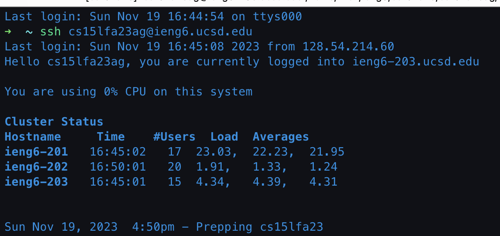
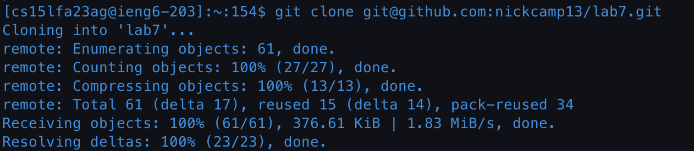
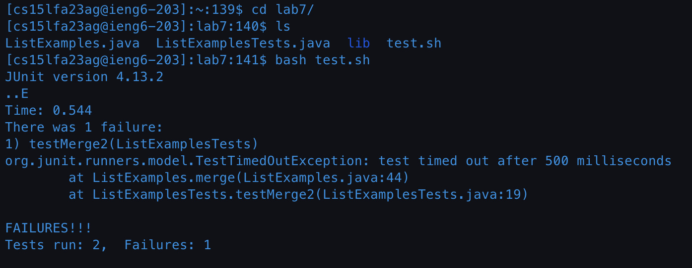
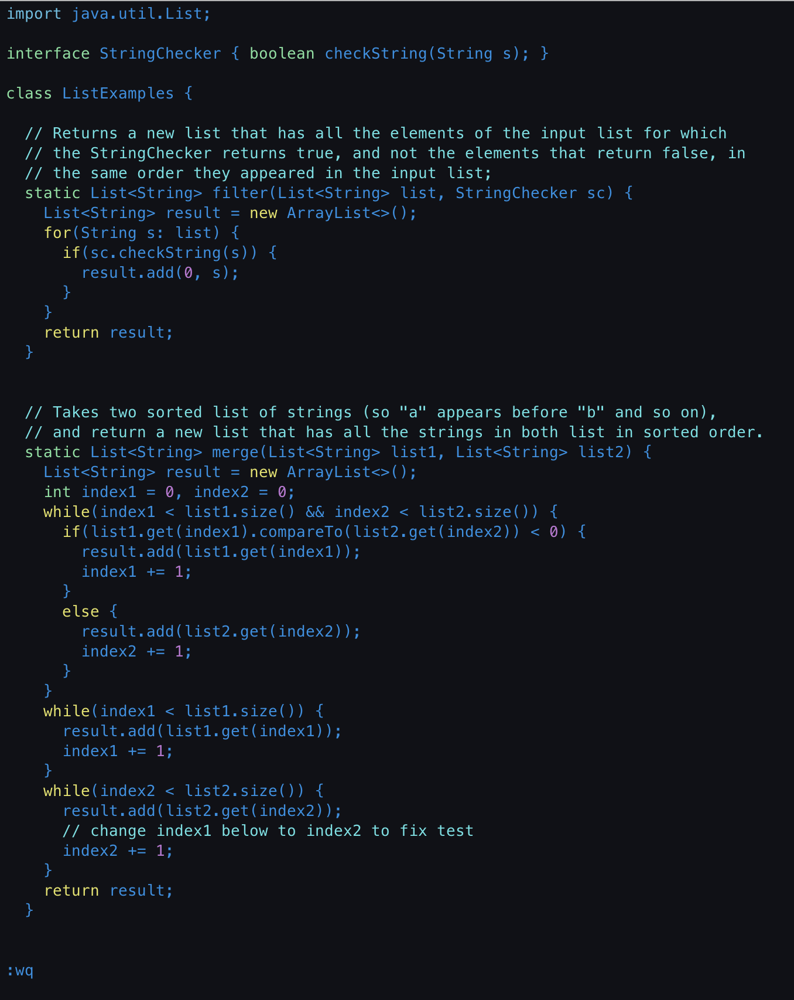
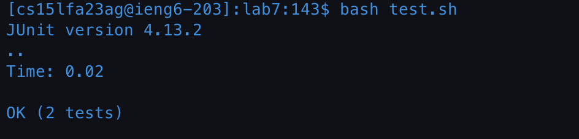
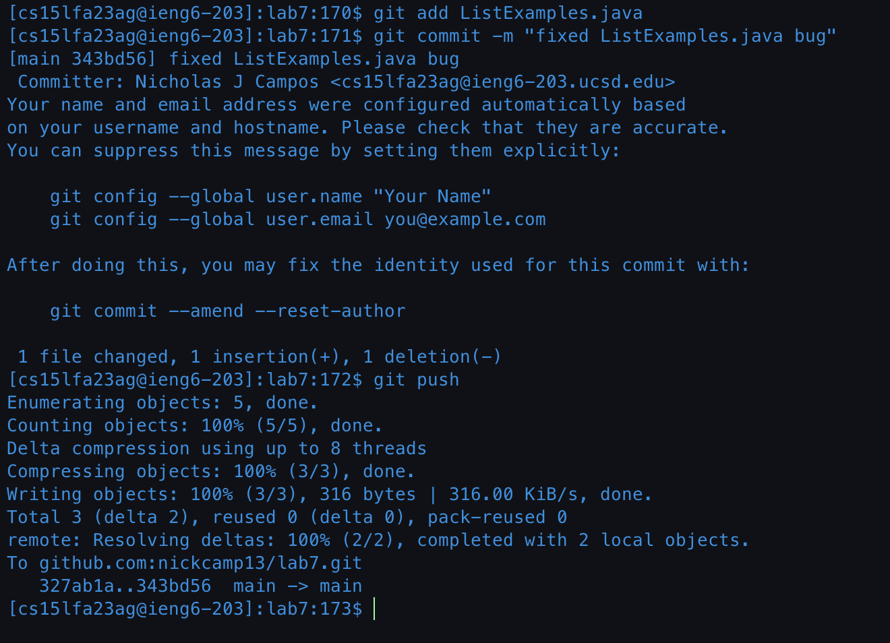

# Lab Report 4 "Vim"

## Step 4

"Log into ieng6"

Keys Pressed:

`ssh cs15lfa23ag@ieng6.ucsd.edu` to connect to the remote ieng6 server for my specific account.

## Step 5

"Clone your fork of the repository from your Github account (using the SSH URL)"

Keys Pressed:

`git clone` The ssh url was saved to my clipboard so I used the paste shortcut, `<cmd> + v`. This created a local repository of the forked branch of lab7 on my ieng6 remote server.

## Step 6

"Run the tests, demonstrating that they fail"

Keys Pressed:

`cd lab7` I forgot the name of the script to run the tests so I used `ls`. Then I typed out `bash tes` and then pressed `<tab>` to finish the command to run the tests. the cd command changed my directory to the recently cloned repository. the bash command ran the test.sh script which ran the command to run the java tests.

## Step 7

"Edit the code file to fix the failing test"

Keys Pressed:

`vim List` and then pressed tab to which that autocompleted to `vim ListExamples` and then I started typing `.j` where I then hit another tab for it to finish the autocomplete to `List.Examples.java`. Vim loaded me into the desired file and I pressed `<shift> + g` to go to the bottom of the file. `kkkkkk` to get to the line that the bug was at. `llllll` to get to the end of index1. `i` to enter insert mode. `<backspace> 2` to fix the bug. `<escape>` to exit insert mode and return to normal mode. `:wq` to write to file and exit vim. the vim command started vim with the specified file.

## Step 8

"Run the tests, demonstrating that they now succeed"

Keys Pressed:

The command to run the bash script that ran the tests was in my command history so I pressed `<up><up><enter>`. This ran the same tests as in step 6.

## Step 9

"Commit and push the resulting change to your Github account (you can pick any commit message!)"

Keys Pressed:

`git add ListExamples.java` to add the file to staging. `git commit -m "fixed ListExamples.java bug` to commit the changed file. `git push` to push the commit to my forked branch on github. This process updated the remote repository on github with the changes on made on my local repository.
