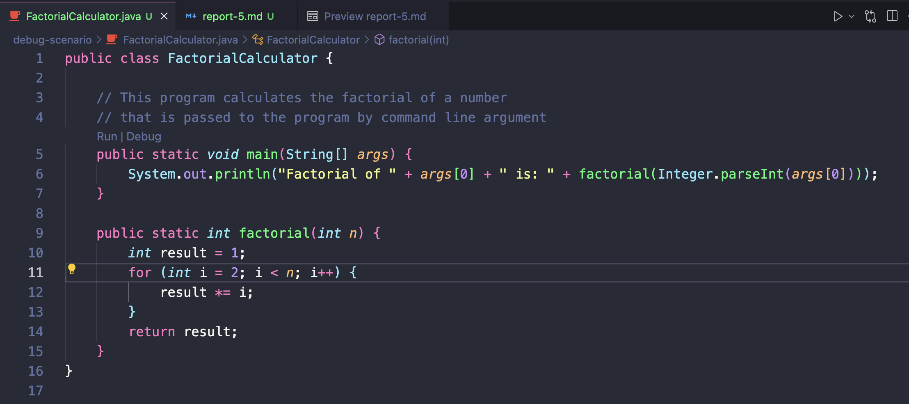
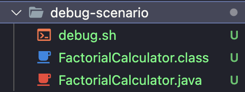

# Lab Report 5 "Putting it All Together"

## Part 1 - "Debugging Scenario"

1. Original Post

   ```
   Factorial Calculation Bug

   I wrote a Java program to calculate the factorial of a number, but it's not giving the correct answers. For example, the factorial of 5 is coming out wrong. Can't figure out what's going wrong in the loop.
   ```

   
   

2. TA's Response

```
It seems like there might be an issue with your loop that calculates the factorial. Check your loop's starting point and condition. Are you correctly iterating through all the numbers you need for the factorial calculation?
```

3. Correct Output + Explanation of Bug
   

```
I reviewed the loop and realized I had set the wrong ending point for the loop. After iterating up to n inclusive, the factorial calculation is now correct.
```

4. Setup

File Structure



`FactorialCalculator.java` before the fix

```java
public class FactorialCalculator {

  // This program calculates the factorial of a number
  // that is passed to the program by command line argument
  public static void main(String[] args) {
      System.out.println("Factorial of " + args[0] + " is: " + factorial(Integer.parseInt(args[0])));
  }

  public static int factorial(int n) {
      int result = 1;
      for (int i = 2; i < n; i++) {
          result *= i;
      }
      return result;
  }
}
```

`debug.sh` before the fix
```bash
javac FactorialCalculator.java

# Check if the compilation was successful
if [ $? -eq 0 ]; then
    # This script depends on passing an integer argument
    java FactorialCalculator $1
else
    echo "Compilation failed. Please check your Java code for errors."
fi
```

Command to trigger the bug
```bash
bash debug.sh 5
```

To fix the bug the condition to stop the for-loop shoud be `<=` instead of `<`

## Part 2 - Reflection

One thing I learned that was very useful in helping me prepare for the last skill demo was learning how to create sub-directories using `mkdir` that do not exist in a directory that does not exist. In order to do so you need to use the `-p` flag which enables the command to create parent directories as necessary. If the directories exist, no error is specified. 

For example. Say I want to create a directory `b` inside a director `a` that does not exist. I can create both directories in one command by executing `mkdir -p a/b`.